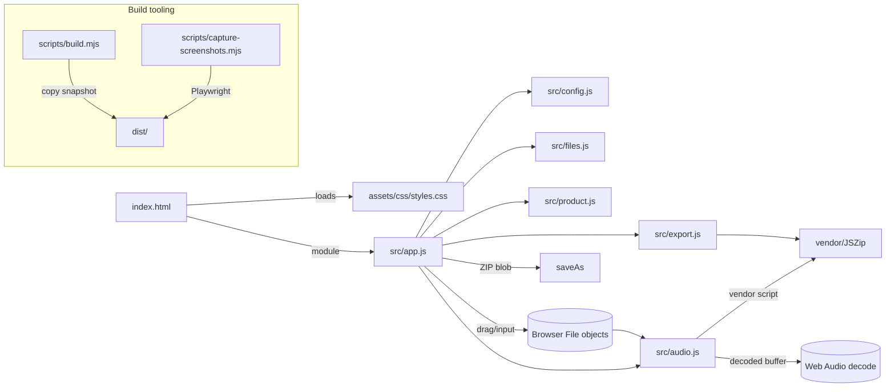
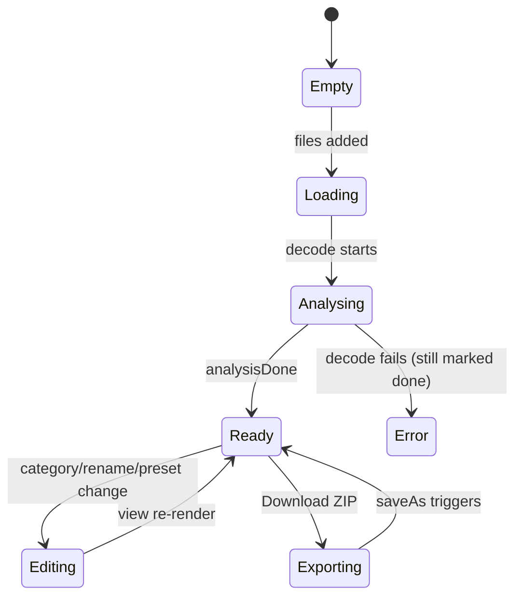
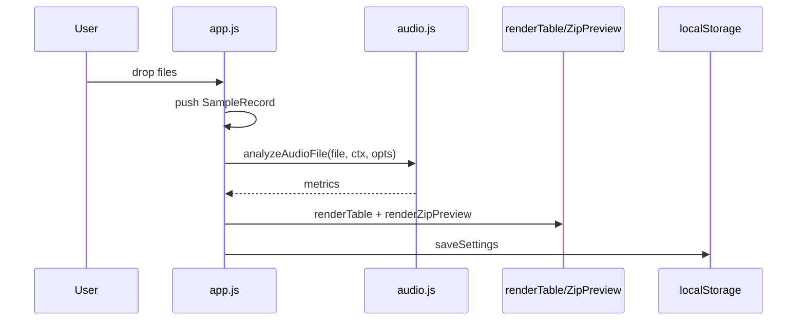
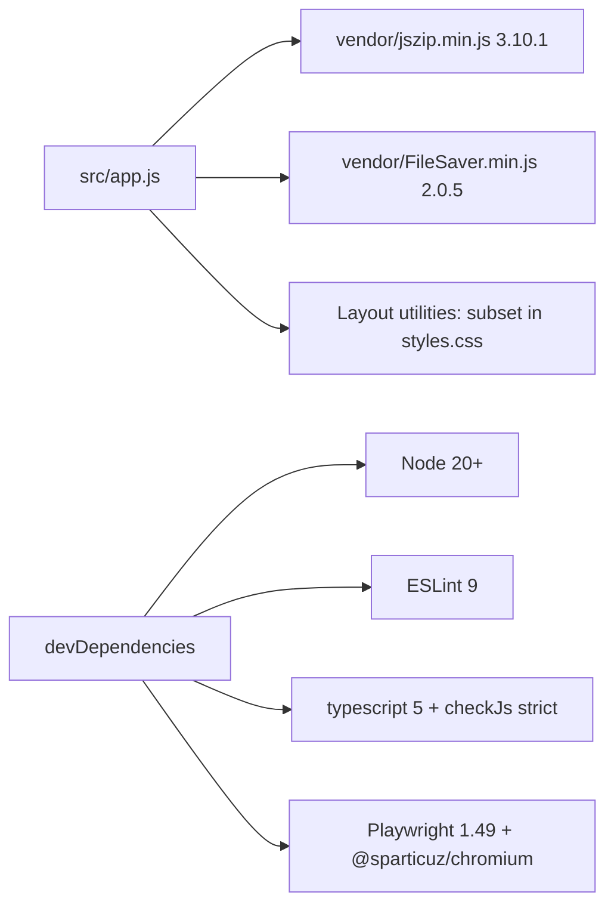

# Architecture

This is the system-level design of **Sample Pack Alchemist**. It is written for
a curator, collaborator, senior engineer, or research lab who wants to
understand both the conceptual intent and the implementation choices.

> Story first: the project is a "digital foundry" for audio archives. It has a
> **cybernetic-archive aesthetic** — near-black chassis, gold pigment, red alert
> traces, dotted diagnostic hints — but that persona is implemented with plain
> HTML/CSS/ES modules. There is no framework, no bundler, and no runtime server.

## 1. System architecture

The application is a **static browser instrument**. The only expensive runtime
dependency is the browser's own Web Audio decoder.

The page is **buildless at runtime**. `dist/` is a copy snapshot produced by
`scripts/build.mjs`; the same source tree can be opened directly if the browser
permits ES modules from `file://` (GitHub Pages removes that concern).

## 2. Component / module boundaries

| Module | Responsibility | Pure? | Talks to DOM? |
| --- | --- | --- | --- |
| `src/config.js` | Constants, category vocabulary, preset copy, concept bank | yes | no |
| `src/audio.js` | Extension/name inference, duration classification, channel measurement, decode+analyze | mostly | no |
| `src/files.js` | Grouping, safe naming, rename-template engine, settings snapshot | yes | no |
| `src/product.js` | Curated/custom copy generation | yes | no |
| `src/export.js` | Metadata text, ZIP assembly, archive-name generation | mostly | no |
| `src/app.js` | State, DOM refs, event wiring, rendering, analysis orchestration | no | yes |

The intentional asymmetry is that **the controller is the only DOM-facing
module**. Everything algorithmic is testable in Node.

## 3. State flow

State is deliberately small and flat. There is no reactive framework; `renderTable`
and `renderZipPreview` are the two derived-view functions.

Roughly:

1. `handleFiles()` pushes `SampleRecord`s, selecting them by default, and calls
   `analyzeFiles()`.
2. `analyzeFiles()` decodes each pending file via `audioContext.decodeAudioData`.
3. On completion it stamps `category`, `bpm`, `key`, `duration`, `loudness`,
   `peak`, `isLoop`, and `analysisDone`.
4. `renderTable()` builds table HTML and rebinds per-row events.
5. `renderZipPreview()` groups records and renders the fictitious-ish folder tree.
6. `saveSettings()` snapshots the form into `localStorage` key `spa_settings`.

## 4. Rendering pipeline

The table uses `innerHTML` for rows because the template is the clearest
readable structure for this small domain. User-controlled strings are run
through `escapeHtml()`.

## 5. Audio / data flow

- **Input:** `File` objects (WAV/AIFF/AIFF/FLAC/MP3, filtered by extension).
- **Decode:** one shared `AudioContext` per session; each decoded buffer is a
  copy (`arrayBuffer.slice(0)`) so `decodeAudioData` cannot detach the caller's
  reference.
- **Measurement:** first channel only — RMS → dB (clamped at -60 so quiet files
  render), peak → dB.
- **Inference:** filename-keyword category, `NNbpm`/`_NN_` BPM, and `An` key.
- **Classification:** `<2s` one-shot, `2–8s` loop, `>8s` texture, unless the
  filename already chose a category.
- **Export:** for each record, `file.arrayBuffer()` is re-read and written to a
  JSZip folder. A `_metadata/` folder gets five generated text blobs.

## 6. Browser APIs

| API | Use | Notes |
| --- | --- | --- |
| `File` / `FileList` | Input audio | Never uploaded |
| `AudioContext` + `decodeAudioData` | Decode + measure | One context per session |
| `localStorage` | Settings persistence | Best-effort, caught |
| `Blob` + `URL.createObjectURL` *implicit* | Download path | FileSaver uses it |
| `webkitdirectory` | Folder upload | Chromium; filtered down to `File`s |
| `window.confirm` | Destructive actions | Simple, accessible enough |

## 7. External dependencies

Two vendored UMD libraries, plus dev-time tooling.

The runtime no longer loads Tailwind from a CDN. The exact utility subset used
by the markup is encoded in `assets/css/styles.css`, making the archive
reproducible offline and deterministic in CI.

## 8. Performance decisions

- **No bundler.** The source is already small; a copy pipeline preserves
  debuggability and reproducibility over code-size savings.
- **Single AudioContext.** Browsers cap contexts and mobile autoplay policies
  complicate multiple contexts.
- **Sequential analysis with a 10 ms yield** per file. Decode is CPU-bound; the
  yield keeps the progress bar and UI responsive without a worker architecture.
- **First-channel only.** For packaging metadata, the extra work of multichannel
  RMS + true LUFS is disproportionate for the current instrument's scope.
- **In-memory ZIP.** JSZip generates a `Blob` in memory. Acceptable for sample
  packs; large archives remain a known limitation.

## 9. Limitations and technical compromises

- **BPM / key are filename heuristics.** There is no actual pitch or onset
  detection. The `defaultBpm`/`defaultKey` settings exist precisely because this
  is honest about what it guesses.
- **Loop vs one-shot is duration-based.** Real loop detection needs onset
  analysis, which the browser does not expose without heavier libraries.
- **Loudness is first-channel RMS in dBFS**, not LUFS. It is a production
  quick-glance number, not a mastering value.
- **No worker thread.** Decoding large batches can freeze input on low-end
  devices. A worker + `OfflineAudioContext` is the correct long-term fix.
- **No upload/host.** That is a deliberate constraint, not a missing feature.
- **`webkitdirectory` is non-standard** (WebKit/Chromium). Firefox falls back to
  single-file upload.
- **Curated presets are fictional copy.** They are product-narrative data to
  demonstrably exercise the generator, not claims about bundled sounds.

## 10. Reading directory

- `src/` — source modules
- `scripts/` — build, dev server, fixtures, screenshot, social
- `assets/css/styles.css` — all custom + layout-subset CSS
- `vendor/` — vendored runtime libraries
- `test/` — node:test unit tests
- `docs/technical/` — subsystem detail
