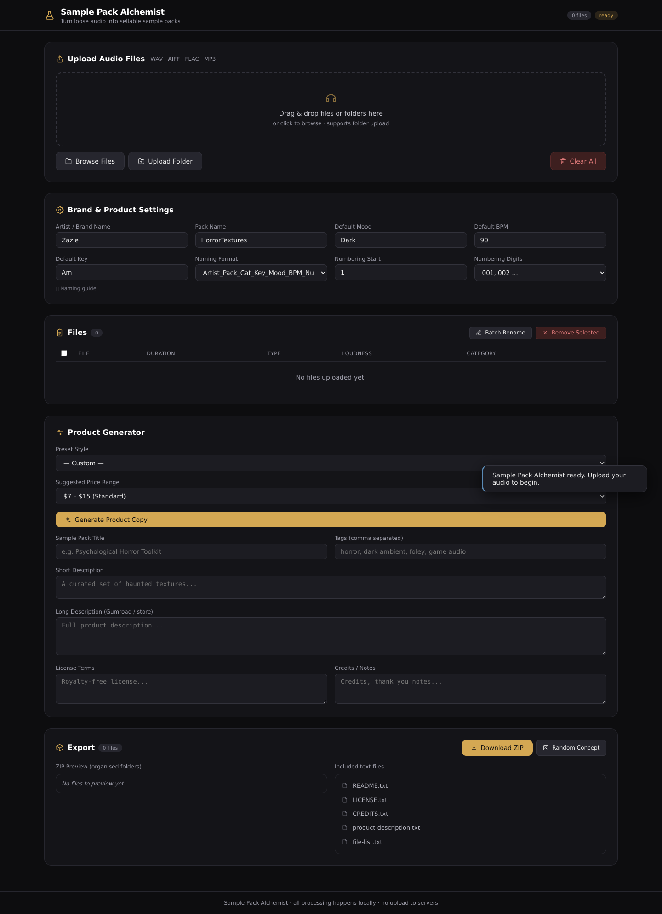

# Sample Pack Alchemist

**A browser-only audio archive that turns loose samples into catalogued, renamed, and market-ready sample packs — entirely offline.**

Created by **Zazie Productions**

[](https://zazieproductions.github.io/Sample-Pack-Alchemist/)

[**Launch Live Project →**](https://zazieproductions.github.io/Sample-Pack-Alchemist/)

---

## What it is (and isn't)

This is a **creative-technology instrument**, not a SaaS dashboard. It takes raw
audio files and runs them through a local pipeline: decode, measure, infer,
categorise, rename, write product copy, and assemble a sellable ZIP. Everything
happens **in the browser tab** — no files are uploaded, no account is created,
and no analytics fire.

**It is working:** upload → analysis → table → rename → copy → ZIP export.

**It is partial:** BPM/key/category are filename heuristics; the loop flag is a
duration heuristic; noise/RMS measurement is first-channel only.

**It is planned:** see [ROADMAP.md](ROADMAP.md) for real tempo detection,
frequency-domain views, and persistence.

## First screen

The preview above is a **real capture** of the application and links to the live
deployment. A second capture shows the [active generative state](docs/images/project-active.png),
and the strongest technical detail is visible in the [export structure](docs/images/project-detail.png).

## Stack


## Audio warning

Analysis decodes files with the **Web Audio API**. Decoding is
**not playback** — nothing is audible unless you wire an analyser yourself.
On very large batches, decoding is memory-heavy; keep packs to a few hundred
files at a time. Use the **Download ZIP** button, which rescales nothing and
exports the original bytes with their renamed metadata.

## Run it

```bash
npm ci
npm run check       # lint + typecheck + unit tests
npm run build       # builds dist/
npm run screenshots # real captures to docs/images/
npm run social      # 1280x640 GitHub social preview
```

`npm run start` serves the repo root locally on port `8080`. The production
deployment is a static snapshot of `dist/`.

## How the instrument works

```
decode → measure (duration, RMS, peak)
       → infer (category/BPM/key by filename)
       → categorise (duration heuristic)
       → table (manual override)
       → rename template
       → product copy (curated presets or real catalogue)
       → ZIP (original bytes + generated metadata)
```

The whole pipeline is documented in [ARCHITECTURE.md](ARCHITECTURE.md) with
Mermaid diagrams. Subsystem detail lives in [docs/technical](docs/technical/).

## Documentation hierarchy

| File | Role |
| --- | --- |
| [README.md](README.md) | Orientation & portfolio presentation |
| [ARCHITECTURE.md](ARCHITECTURE.md) | System-level design |
| [docs/technical](docs/technical/) | Subsystem detail |
| [CHANGELOG.md](CHANGELOG.md) | Release history |
| [ROADMAP.md](ROADMAP.md) | Working pipeline / deferred ideas |
| [CONTRIBUTING.md](CONTRIBUTING.md) | How to collaborate |
| [SECURITY.md](SECURITY.md) | Vulnerability reporting and scope |

## License

MIT. See [LICENSE](LICENSE).
