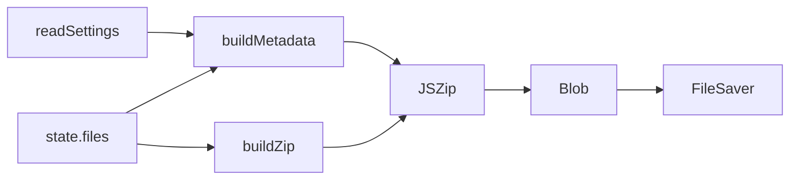

# ZIP export

**Domain:** `src/export.js`, `vendor/`

Export is the shipping line: it bundles the original audio bytes and the
generated metadata into one archive, entirely in memory.

## Archive shape

```
Artist_Pack.zip
├── Bass/
│   └── Zazie_Artist_Pack_Bass_Am_Dark_90_001.wav
├── Drums/
├── Loops/
└── _metadata/
    ├── README.txt
    ├── LICENSE.txt
    ├── CREDITS.txt
    ├── product-description.txt
    └── file-list.txt
```

Category folders come from `groupByCategory`. Metadata is generated at export
time (not persisted) so stale settings are never frozen into a release.

## Data flow



## Why dependency injection

`buildZip(files, metadata, deps, zipName)` receives `{ zip, save }`. In the
browser these are `globalThis.JSZip` and `globalThis.saveAs` (the vendored UMD
globals). In Node tests, the test passes `jszip` itself. This keeps the module
testable without a global browser shim.

## Compression

`DEFLATE` is applied. Audio files are typically already compressed, so for WAV
it yields some reduction; for FLAC/MP3 it mostly adds CPU. The choice favours
predictability of file size over speed.

## Filename safety

`buildZipName` turns Artis/Pack settings into `Artist_Pack`. The catalogued
record names are already sanitised by the rename engine. If a user drags in a
file and exports without renaming, the original filename is preserved verbatim;
it is the user's choice.
